# Dehazing for Object Detection

This project removes fog from foggy images and aligns the dehazed output with YOLO object detection. The goal is to improve object detection performance in foggy environments by first removing haze and then detecting objects on the dehazed image.

## Overview

- Input: foggy/hazy images
- Dehazing models used:
  - AODNet
  - FFA-Net
  - GridDehazeNet
  - DCP (Dark Channel Prior)
  - DehazeFormer
  - FFA-Net Enhanced
- Output: dehazed image + YOLO-aligned object detection results

## How it works

1. Start with a foggy image.
2. Apply a dehazing model to remove fog.
3. Pass the dehazed image through YOLO for object detection.
4. Compare the original foggy image, the dehazed result, and the YOLO-detected output.

## Results by Model

### AODNet

**Foggy image**

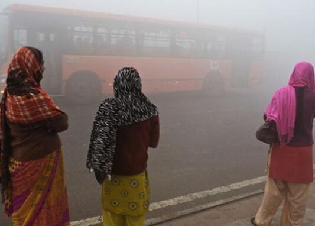

**Model**: `AODNet`

**Dehazed image**

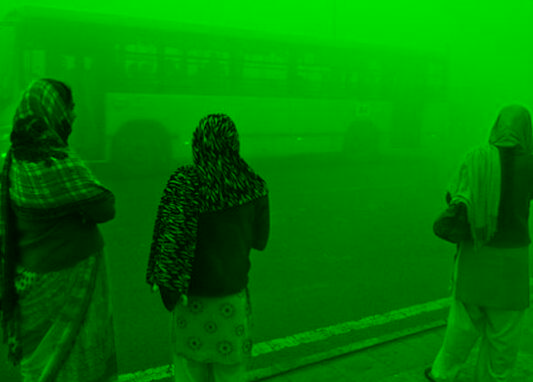

**YOLO aligned result**

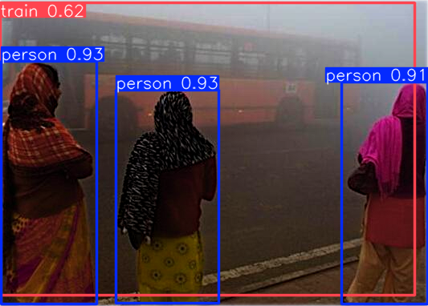

---

### FFA-Net

**Foggy image**

**Model**: `FFA-Net`

**Dehazed image**

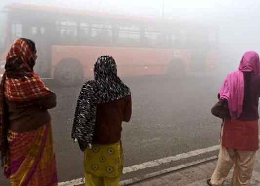

**YOLO aligned result**

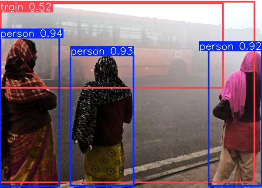

---

### GridDehazeNet

**Foggy image**

**Model**: `GridDehazeNet`

**Dehazed image**

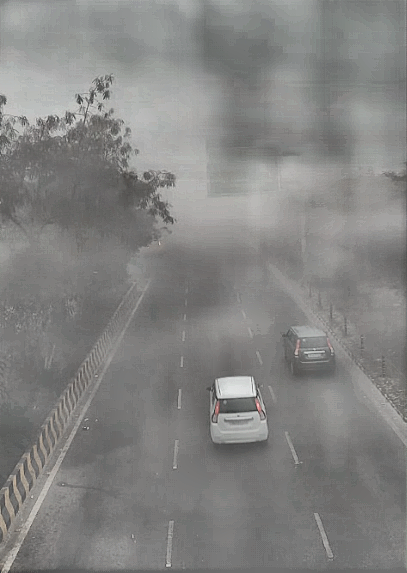

**YOLO aligned result**

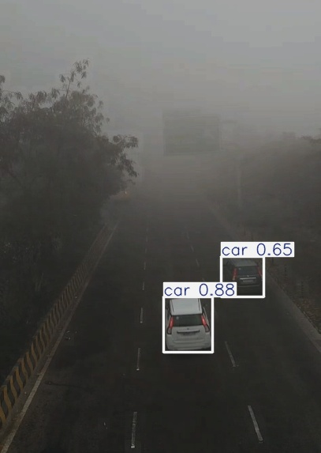

---

### DCP (Dark Channel Prior)

**Foggy image**

**Model**: `DCP`

**Dehazed image**

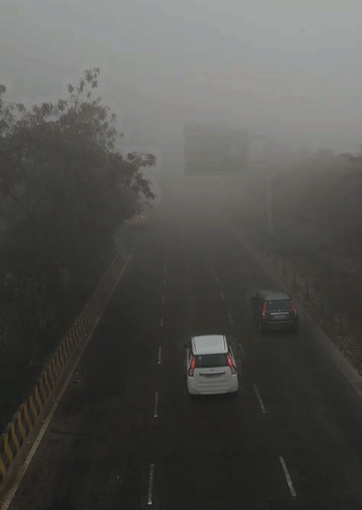

**YOLO aligned result**

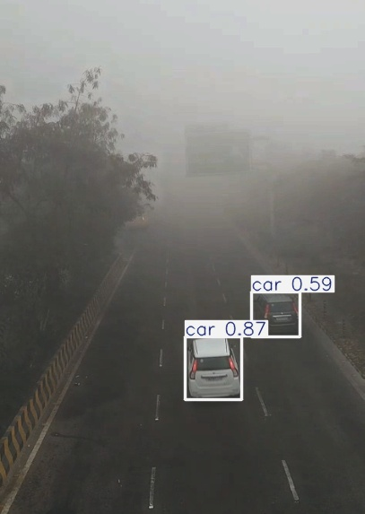

---

### FFA-Net Enhanced

**Foggy image**

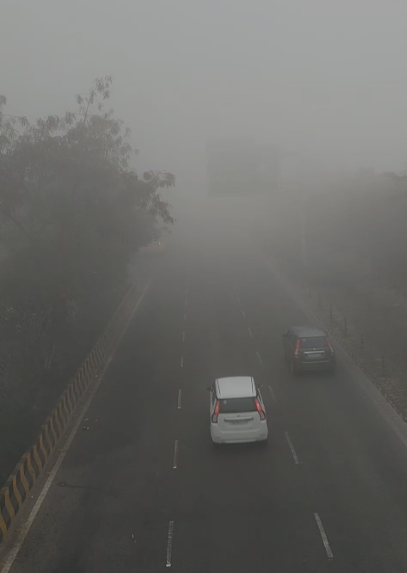

**Model**: `FFA-Net Enhanced`

**Dehazed image**

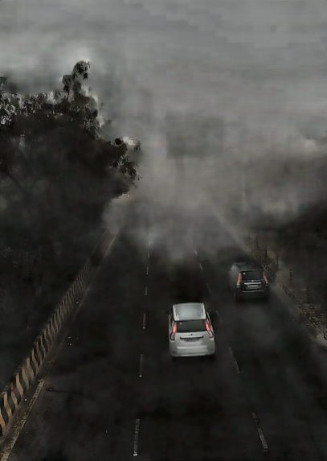

**YOLO aligned result**

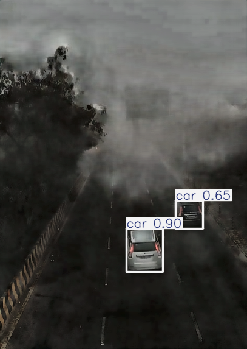

---

## Example flow

For each model, this README shows:

1. **Foggy image** — the original hazy input.
2. **Model name** — the dehazing architecture used.
3. **Dehazed image** — output after fog removal.
4. **YOLO aligned result** — object detection result on the dehazed image.

## Usage

1. Prepare foggy images in `datasets/SIR_IMAGES/hazy/`.
2. Run the dehazing script for the model you want to test.
3. Run the corresponding YOLO script to generate aligned detection results.
4. Inspect the outputs and compare the foggy, dehazed, and detected results.

## Notes

- The repository uses multiple dehazing methods aligned with YOLO.
- This README is designed to show the foggy input first, then the model name, the dehazed result, and the YOLO result for each model.
- Large model weights and dataset outputs are excluded from the repository and should be configured separately.

## Model scripts

- `experiments/aodnet_yolo.py`
- `experiments/ffa_dehaze.py`
- `experiments/ffanet_yolo.py`
- `experiments/ffanet_enhanced_yolo.py`
- `experiments/griddehaze_yolo.py`
- `experiments/dcp_yolo_rtts.py`
- `experiments/dehazeformer_yolo.py`

---

> This project demonstrates fog removal and object detection by combining dehazing models with YOLO.
