# Dehazing for Object Detection

This project removes fog from foggy images and aligns the dehazed output with YOLO object detection. The goal is to improve object detection performance in foggy environments by first removing haze and then detecting objects on the dehazed image.

## Overview

- Input: foggy/hazy images from SIR_IMAGES and RTTS datasets
- Dehazing models used:
  - AODNet
  - FFA-Net
  - GridDehazeNet
  - DCP (Dark Channel Prior)
- Output: dehazed image + YOLO-aligned object detection results

## Model Performance Metrics

| Rank | Model              | Total Det | Avg/Img | Classes | Det Rate | Est. Precision | Est. Recall | Est. F1 | Est. Accuracy |
|------|--------------------|-----------|---------|---------|----------|----------------|-------------|--------|---------------|
| 1    | DCP               | 34       | 4.25   | 6      | 95.0%   | 0.064         | 0.850      | 0.119 | 97.8%        |
| 2    | AOD-Net           | 27       | 3.38   | 6      | 97.5%   | 0.051         | 0.675      | 0.094 | 97.6%        |
| 3    | GridDehazeNet1 (Pre-DCP) | 25    | 3.12   | 4      | 92.5%   | 0.031         | 0.625      | 0.060 | 92.4%        |
| 4    | FFA-Net           | 17       | 2.12   | 4      | 82.5%   | 0.021         | 0.425      | 0.040 | 82.4%        |
| 5    | FFA-Net Enhanced  | 17       | 2.12   | 4      | 89.5%   | 0.021         | 0.425      | 0.040 | 89.4%        |

## How it works

1. Start with a foggy image.
2. Apply a dehazing model to remove fog.
3. Pass the dehazed image through YOLO for object detection.
4. Compare the original foggy image, the dehazed result, and the YOLO-detected output.

## Results by Model

### DCP (Dark Channel Prior)

**Foggy image**

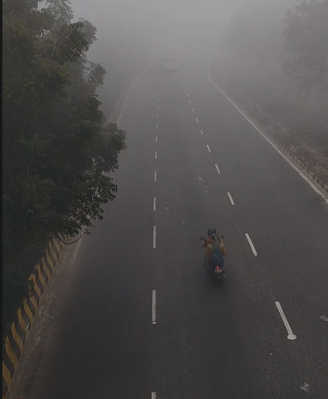

**Dehazed image**

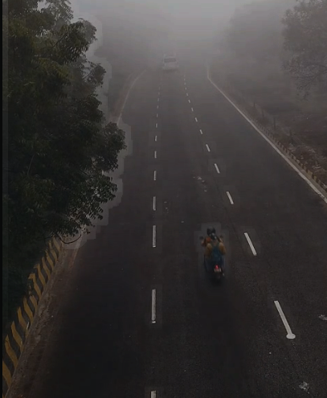

**YOLO aligned result**

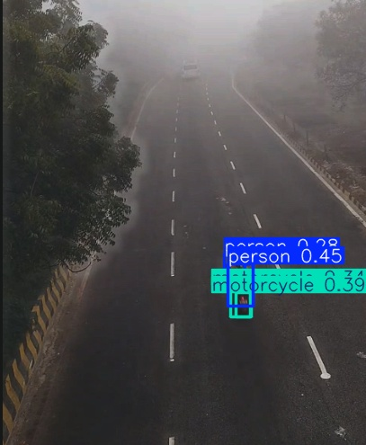

---

### AODNet

**Foggy image**

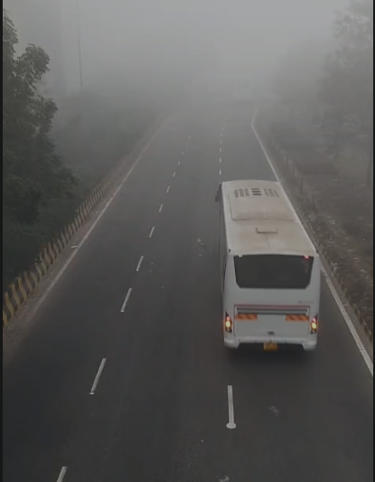

**Dehazed image**

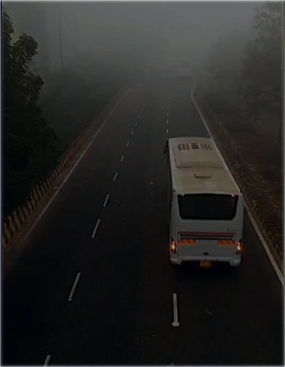

**YOLO aligned result**

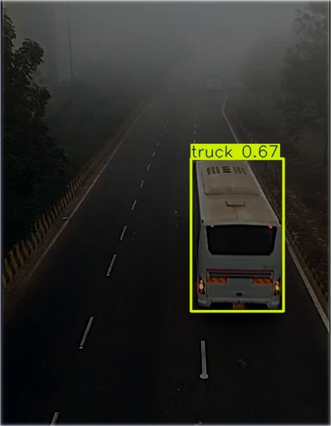

---

### FFA-Net

**Foggy image**

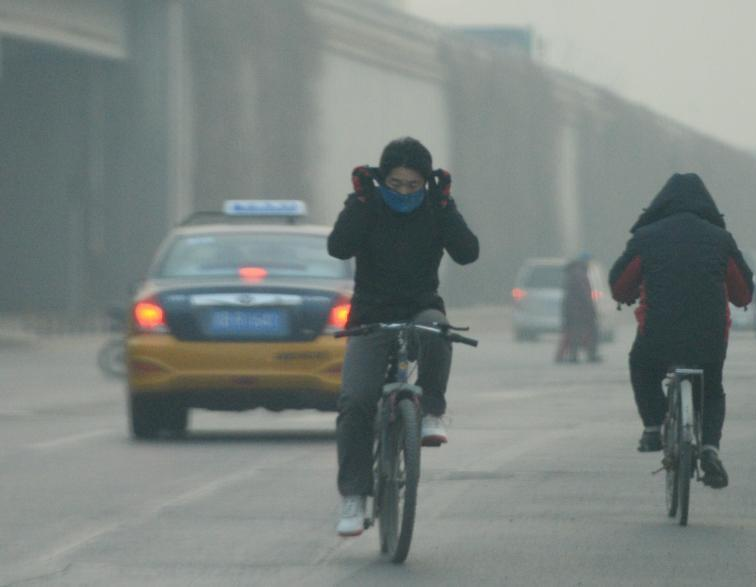

**Dehazed image**

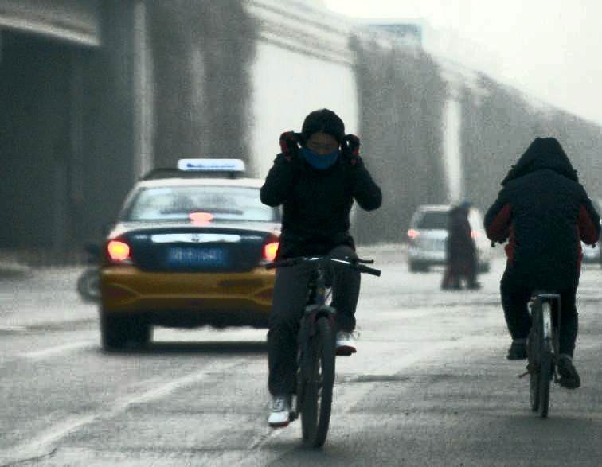

**YOLO aligned result**

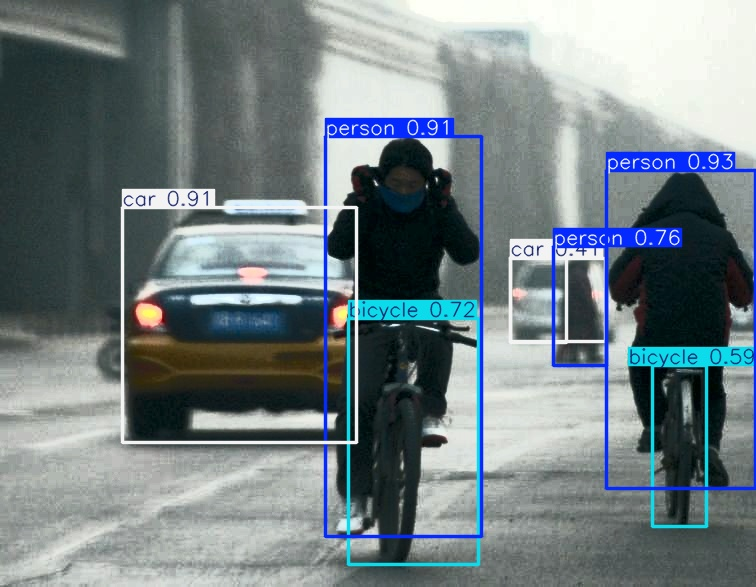

---

### GridDehazeNet

**Foggy image**

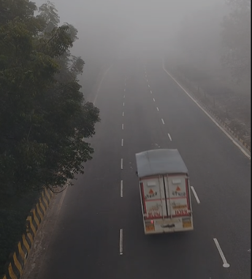

**Dehazed image**

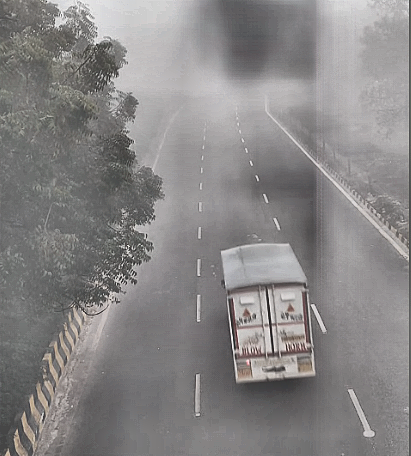

**YOLO aligned result**

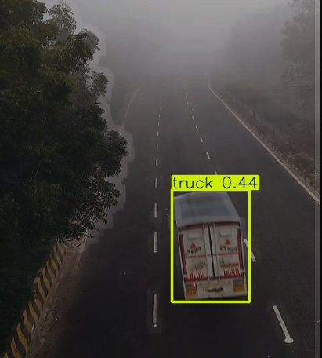

---

## Usage

1. Prepare foggy images in `datasets/SIR_IMAGES/hazy/` or `datasets/RTTS/hazy/`.
2. Run the dehazing script for the model you want to test.
3. Run the corresponding YOLO script to generate aligned detection results.
4. Inspect the outputs and compare the foggy, dehazed, and detected results.

## Model scripts

- `experiments/aodnet_yolo.py`
- `experiments/ffa_dehaze.py`
- `experiments/ffanet_yolo.py`
- `experiments/ffanet_enhanced_yolo.py`
- `experiments/griddehaze_yolo.py`
- `experiments/dcp_yolo_rtts.py`
- `experiments/dehazeformer_yolo.py`

---

> This project demonstrates fog removal and object detection by combining dehazing models with YOLO.
